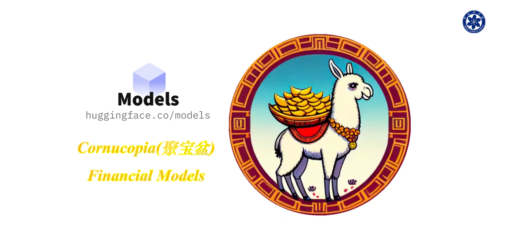

 

  

 

# Cornucopia-LLaMA-Fin-Chinese
### 聚宝盆(Cornucopia): 基于中文金融知识的LLaMA微调模型

---

本项目开源了经过中文金融知识指令精调/指令微调(Instruct-tuning) 的LLaMA-7B模型。通过中文金融公开数据+爬取的金融数据构建指令数据集，并在此基础上对LLaMA进行了指令微调，提高了 LLaMA 在金融领域的问答效果。

基于相同的数据，后期还会利用GPT3.5 API构建高质量的数据集，并且在[中文知识图谱-金融](http://www.openkg.cn/group/finance)上进一步扩充高质量的指令数据集

陆续会发布研发的新模型（next-pretrain、multi-task SFT、RLHF Optimize），欢迎大家届时使用体验。

