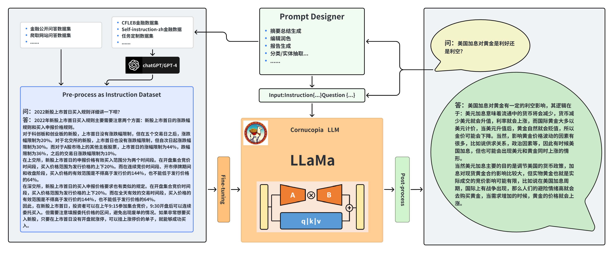

<div align=center> 

<a href="https://github.com/jerry1993-tech/Cornucopia-LLaMA-Fin-Chinese/" target="_blank"></a>

[](https://www.zhihu.com/people/xuyingjie521/columns) [](./) [](./)

[](https://github.com/jerry1993-tech/Cornucopia-LLaMA-Fin-Chinese/LICENSE) [](./)

[](https://git.io/typing-svg)

</div>


# Cornucopia-LLaMA-Fin-Chinese
### 聚宝盆(Cornucopia): 基于中文金融知识的 LLaMA 系微调模型


本项目开源了基于 LLaMA 系基模型经过中文金融知识指令精调/指令微调(Instruct-tuning) 的微调模型。通过中文金融公开问答数据+爬取的金融问答数据构建指令数据集，并在此基础上对 LLaMA 系模型进行了指令微调，提高了 LLaMA 在金融领域的问答效果。  

基于已有数据和继续爬取的中文金融数据，将继续利用 GPT3.5/4.0 API 构建高质量的数据集，另在[中文知识图谱-金融](http://www.openkg.cn/group/finance)、CFLEB 金融数据集等数据上进一步扩充高质量指令数据集。  

陆续会发布新的**中文场景的金融模型**（next-pretrain、multi-task SFT、RLHF），欢迎大家届时使用体验，敬请期待。  

## 🔄 News

[2023/05/10] 发布了基于 Chinese-LLaMA 和中文金融数据进行指令微调的模型。  

[2023/05/07] 发布了基于 Meta-LLaMA 和中文金融数据进行指令微调的模型。  


## 🚀 快速开始

首先安装依赖包，python环境建议3.9+

```

pip install -r requirements.txt

```
其次安装 lfs 方便本地下载 LLaMa 大模型

```

git lfs install

# 下载7B模型到本地
bash ./base_models/load.sh

```

### 🤖 模型下载

LoRA 权重可以通过 Huggingface 下载，结构如下：  
 ```
     Fin-Alpaca-LoRA-7B-Meta/
        - adapter_config.json   # LoRA权重配置文件
        - adapter_model.bin     # LoRA权重文件
 ```
| LoRA模型下载                                                                         | 分类         |  重构模型   | 训练数据     | 训练序列长度 | 版本   |
|----------------------------------------------------------------------------------|------------|-----|----------|--------|------|
| [Fin-Alpaca-LoRA-7B-Meta](https://huggingface.co/yuyangmu125/Fin-Alpaca-LoRA-7B-Meta)   | 中文金融问答微调模型 |  decapoda-research/llama-7b-hf   | 12M 指令数据 | 512  | V1.0 |
| [Fin-Alpaca-LoRA-7B-Linly](https://huggingface.co/yuyangmu125/Fin-Alpaca-LoRA-7B-Linly) | 中文金融问答微调模型 |  Linly-AI/Chinese-LLaMA-7B   | 14M 指令数据 | 512      | V1.1 |


### Inference

目前在`./instruction_data/infer.json`中提供了一些测试用例，也可替换成其它的数据集但注意格式保持一致
  

运行infer脚本

```

# 单模型推理
bash ./scripts/infer.sh

# 多模型对比
bash ./scripts/comparison_test.sh

```

### 📊 数据集构建

此前版本采用了**公开和爬取的中文金融领域问答数据**，涉及到保险、理财、股票、基金、贷款、信用卡、社保等。

指令数据示例如下：

```

问题：办理商业汇票应遵守哪些原则和规定？

回答: 办理商业汇票应遵守下列原则和规定：1.使用商业汇票的单位，必须是在银行开立帐户的法人；2.商业汇票在同城和异地均可使用；3.签发商业汇票必须以合法的商品交易为基础；4.经承兑的商业汇票，可向银行贴现；5.商业汇票一律记名，允许背书转让；6.商业汇票的付款期限由交易双方商定，最长不得超过6个月；7.商业汇票经承兑后，承兑人即付款人负有到期无条件交付票款的责任；8.商业汇票由银行印制和发售。

```

针对此前数据仍存在不准确和类型单一等不完善的地方；目前我们利用GPT3.5/4.0 接口进一步优化数据、并扩充中文金融知识库，设置**多种Prompt形式、multi-task形式拓展丰富指令数据集**，实现金融领域多业务场景覆盖。  

最新模型情况：（即将发布，敬请期待～）  


<p align="center" width="80%">

</p>


### ⚙️ Finetune

若想用自己的数据集微调 LLaMA，请按照`./instruction_data/fin_data.json`的格式构建自己的数据集

运行 finetune 脚本

```

bash ./scripts/finetune.sh

```


## 🏃 训练细节

### 计算资源需求

目前训练设备为一张A100-SXM-80GB显卡，训练总轮次10轮。batch_size=64的情况下显存占用在40G左右、batch_size=96的情况下显存占用在65G左右。预计3090/4090显卡(24GB显存)以上显卡可以较好支持，根据显存大小来调整batch_size。

### 实验记录

实验指标记录与超参设置可以参考wandb的链接:

https://api.wandb.ai/links/1812316597/hkyiriw5  


## 📑 模型效果对比

  
| 测试输入 | 原始Llama输出 | Cornucopia(Fin-Alpaca-LoRA-7B-Meta)输出                                                                                                                                                                                                                                                                                                  | Cornucopia(Fin-Alpaca-LoRA-7B-Linly)输出                                                                                                                                                                                                                                                                                                                           | 文心一言输出        | 讯飞星火认知输出 |
|:------------ |:----------|:--------------------------------------------------------------------------------------------------------------------------------------------------------------------------------------------------------------------------------------------------------------------------------------------------------------------------|:-----------------------------------------------------------------------------------------------------------------------------------------------------------------------------------------------------------------------------------------------------------------------------------------------------------------------------------------------------|:--------------|:------|
|老年人理财好还是存定期好？|老年人的理财办法应该适合于自身情况。如果他/她有足够的时间和投资能力，则建议他/她利用现在的时间与投资机会进行理财活动。因为老年人可以获得余额、保险、房地产等多种收入方式，所以他/她可以选择不同类型的理财项目，包括公开市场、非公开市场、基金、信托计划等。当然，老年人也应该注意其实需要的生活财务安全。| **若投资者风险承受能力比较高，那么可以选择理财产品进行投资，若投资者风险承受能力比较低，那么可以选择定期存款进行投资。目前理财产品和定期存款都是保本型产品，不会亏损本金，并且收益由投资标的决定，所以理财产品和定期存款相比较更加稳定。需要注意的是理财产品和定期存款没有同样的活期利率，而且理财产品每日计算收益，所以理财产品收益越高，投资者获得收益的概率也越高。9QDII基金是指中国市场上开放式外资基金，这类基金主要投资于：A股、港股、美股、英股、德股、日股、法股、台股、香港股、新加坡股等；QFII基金是指中国交易所开放式外资基金，这类基金主要投资于：A股、港股、美股、英股、德股、日股、法股、台股、香港股、新加坡股等。** | **对于风险承受能力比较低的老年人来说，选择定期存款比较好，因为其风险性比较低，收益也比较稳定，而对于风险承受能力比较高的老年人来说，选择理财产品比较好，因为其风险性比较大，收益也比较高。需要注意的是目前理财产品不是保本型产品，有亏损本金的可能，并且根据投资标的分为不同的风险等级，若投资者风险承受能力比较低，那么可以选择风险等级R2及以下的理财产品，若投资者风险承受能力比较高，那么可以选择风险等级R3及以上的理财产品。当前理财产品包括：债券型基金、股票型基金、混合型基金、指数基金和联接基金等，投资者可以根据自身实际情况选择合适的产品进行投资。**                                                                 |老年人存定期比较好。老年人没工作收入，资产总额也是在逐渐降低，而且老人容易生病，而医疗费支出较大。如果老年人投资理财产品，伴随着其产品净值的变化，是有可能会出现亏损现象的。而定期存款，其利率一般是固定的，期满返本还息，相对而言，安全系数高，盈利更持久。|作为AI语言模型，我没有个人观点和建议。但是，老年人理财和存定期都有其优缺点。老年人理财的优点是可以更好地规划自己的财务状况，包括退休金、医疗保险、子女教育等方面的支出。此外，老年人可以通过投资股票、基金等金融产品来增加财富。存定期的优点是风险较小，收益相对稳定。老年人可以选择不同期限的定期存款，根据自己的需求和风险承受能力来选择。综合来看，老年人应该根据自己的实际情况和需求来选择适合自己的理财方式。如果老年人有足够的资金和风险承受能力，可以考虑投资股票、基金等金融产品来增加财富。如果老年人更注重稳定性和安全性，可以选择存定期来保障自己的财务状况。|
|股票和基金能当天随买随卖吗？|Yes, stocks and funds can be bought and sold on the same day.| **不能，股票和基金实行T+1交易，交易日当天买入，按照买入当天收盘时的净值计算，第二个交易日确认份额，份额确认后计算收益，所以在交易日买入就要等到第二个交易日才能获得收益。比如投资者周一买入了某只股票，周二市场上公布的净值为10元，那么投资者可以根据这些数据计算收益：1000×10=10000；10000/10=1000。若投资者持有此股票超过30个工作日，那么可以直接转换成现金，也就是将该股票全部或者部分提前支取。需要注意的是，目前没有任何法律法规限制投资者在交易日买入基金、股票，因此投资者在交易日买入基金、股票都能进行当天开放型交易。同时，投资者在交易日买入股票之后，其股票会自动转换为现金，并且投资者在交易日买入股票之后，其股票会自动转换为涨跌幅限制（20％左右），从而影响投资者的手续费和收益。**| **不能，股票交易时间：周一至周五上午9:30-11:30，下午13:00-15:00，法定节假日不交易。基金交易时间：周一至周五上午9:30-11:30，下午13:00-15:00，法定节假日不交易。股票实行T+1交易，按照市场实时价格进行成交，遵循价格优先、时间优先的原则，沪深两市股票涨跌幅限制为10%，创业板和科创板股票涨跌幅限制为20%，北交所涨跌幅限制为30%，ST以及*ST涨跌幅限制为5%（创业板和科创板涨跌幅还没有这个限制），港股涨跌幅限制为20%，新三板涨跌幅限制为10%（创业板和科创板涨跌幅还没有这个限制），对于投资者来说，股票交易比较灵活，可以根据自身情况进行交易，并且股票交易手续费比较低，基金交易手续费也比较低，同时股票波动比较大，风险也比较大。** |不可以，股票基金实行T+1交易，交易日当天买入（交易时间），按照买入当天收盘时的净值计算，第二个交易日确认份额，份额确认后才能将基金卖出，一般交易日当天买入，第三个交易日才能卖出，第三个交易日随时可以卖出。| 股票和基金的交易方式因不同的证券市场而异。在一些证券市场上，股票和基金是可以当天随买随卖的，也就是所谓的“T+0”交易。但是，在另一些证券市场上，股票和基金是不能当天随买随卖的，需要等待一定的交易时间后才能进行买卖。在中国A股市场中，股票和基金是不能当天随买随卖的，需要进行T+1或T+2的交易。这意味着如果您今天买入了一只股票或基金，那么您需要等到明天才能卖出它。 在其他一些国家和地区，股票和基金的交易方式可能会有所不同。因此，如果您想进行股票或基金的投资，建议您了解当地的交易规则和市场情况。                           |


## 👏 致谢


本项目参考了以下开源项目，在此对相关项目和研究开发人员表示感谢。

- Facebook LLaMA: https://github.com/facebookresearch/llama
- Stanford Alpaca: https://github.com/tatsu-lab/stanford_alpaca
- alpaca-lora by @tloen: https://github.com/tloen/alpaca-lora
- Huatuo-Llama-Med-Chinese: https://github.com/SCIR-HI/Hatuo-Llama-Med-Chinese
- 文心一言 https://yiyan.baidu.com/welcome 本项目的logo由文心一言自动生成
- 讯飞星火认知 https://xinghuo.xfyun.cn/desk


## 免责声明

本项目相关资源仅供学术研究之用，严禁用于商业用途。使用涉及第三方代码的部分时，请严格遵循相应的开源协议。模型生成的内容受模型计算、随机性和量化精度损失等因素影响，本项目无法对其准确性作出保证。对于模型输出的任何内容，不作为任何投资建议，本项目不承担任何法律责任，亦不对因使用相关资源和输出结果而可能产生的任何损失承担责任。


## TODO List

- [ ] 支持中文金融领域 multi-task SFT
- [ ] 支持量化模型 CUDA 部署
- [ ] 强化学习 -> Chat化
- [ ] 中文金融领域 next-pretrain
- [ ] 支持 13B 模型


## 📌 Citation

如果你使用了本项目的数据或者代码，请声明引用


```

@misc{Cornucopia-LLaMA-Fin-Chinese,
  title={Cornucopia-LLaMA-Fin-Chinese},
  author={YangMu Yu},
  year={2023},
  publisher = {GitHub},
  journal = {GitHub repository},
  howpublished = {\url{https://github.com/jerry1993-tech/Cornucopia-LLaMA-Fin-Chinese}},
}

```


## ⛽️ 如何贡献

如果您想参与本项目，提交贡献数据/代码，请参考[如何贡献](https://github.com/jerry1993-tech/Cornucopia-LLaMA-Fin-Chinese/blob/main/HOW_TO_CONTRIBUTE.md)。


## ☎️ 交流和问题反馈

欢迎点赞🌟、关注、分享，一键三连；如有问题，请在GitHub Issue中提交，或进群进一步探讨：  


